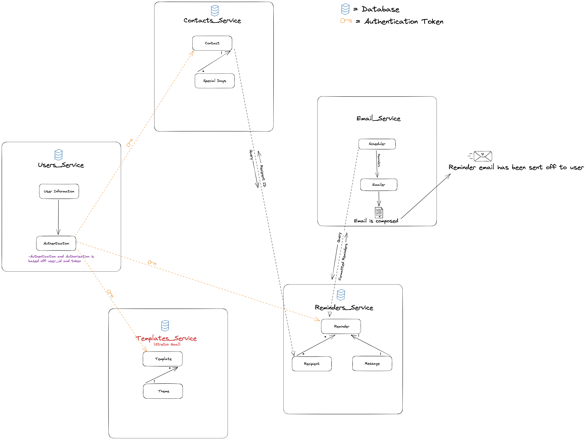

# Soon <sup>TM</sup>

* Alex Pallotta
* Lindsey Carlson
* Ron Seng
* Sean Li

<p>
Hello!  Welcome to Soon-TM.  Relationships are important to us.  The world thrives and revolves around relationships which is why we feel that it’s important to stay in touch.  Life gets busy and we set out to create an app that facilitates genuine interaction and strengthens the relationship with the people you care about.
</p>

<br>
<br>
<br> 

# MVP

* Create an account
* Allow a user to log in and log out (Authentication)
* Allow users to edit settings (Edit account information) (Authorization)
* Create a reminder message
* Allow users to maintain a bank of reminders
* Create a contact list
* Set a reminder for a certain day to be sent to the user via email
* Anonymous users can create reminder messages

<br>
<br>
<br>

# Design Concept



<br>
<br>
<br> 

# Unit Testing

### Create user test
* Testing for successful creation of a User
<br>

### Create reminder test
* Testing for successful creation of a reminder
<br>

### Get all templates test
* Testing for successful retrieval of all templates for a user
<br>

### Create public tempalte test
* Testing for successful creation of a public template

<br>
<br>
<br> 

# Reminders Microservice

## Reminders Endpoints - Quick Overview

| Action | Method | Auth | URL |
| ------ | ------ | ---- | --- |
| Create a reminder | POST | Optional | <https://soontm-reminder-service.onrender.com/reminders>
| Get all reminders for user | GET | Bearer | <https://soontm-reminder-service.onrender.com/reminders>
| Get one reminder | GET | Bearer | <https://soontm-reminder-service.onrender.com/reminders/{reminder_id}>
| Update a reminder | PUT | Bearer | <https://soontm-reminder-service.onrender.com/reminders/{reminder_id}>
| Delete a reminder | DELETE | Bearer | <https://soontm-reminder-service.onrender.com/reminders/{reminder_id}>

use localhost:8001/{api-path} if working on local copy

<br>

## Reminders Endpoints - Detailed

<details>
<summary> Create a Reminder </summary>

* Endpoint path: /reminders
* Method: POST
* Header: Authorization Bearer Optional
* Request shape:
```json
{
  "reminder": {
    "email_target": "string",
    "reminder_date": "2022-12-09",
    "recurring": true
  },
  "message": {
    "template_id": 0,
    "content": "string"
  },
  "recipients": [
    {
      "name": "string",
      "phone": "string",
      "email": "string",
      "user_id": 0
    }
  ]
}
```

* Response: The newly created reminder, with ids


*  Response shape:
```json
{
  "id": 0,
  "user_id": 0,
  "email_target": "string",
  "reminder_date": "2022-12-09",
  "message": {
    "id": 0,
    "template_id": 0,
    "content": "string"
  },
  "sent": true,
  "sent_on": "2022-12-09",
  "recurring": true,
  "created_on": "2022-12-09",
  "recipients": [
    {
      "id": 0,
      "name": "string",
      "phone": "string",
      "email": "string"
    }
  ]
}
```
</details>

<br>

<details>
<summary> Get all Reminders </summary>

* Endpoint path: /reminders
* Method: GET
* Header: Authorization Bearer

* Response: A list of all reminders for a user
* Response shape:
``` json
[
  {
    "id": 0,
    "user_id": 0,
    "email_target": "string",
    "reminder_date": "2022-12-09",
    "message": {
      "id": 0,
      "template_id": 0,
      "content": "string"
    },
    "sent": true,
    "sent_on": "2022-12-09",
    "recurring": true,
    "created_on": "2022-12-09",
    "recipients": [
      {
        "id": 0,
        "name": "string",
        "phone": "string",
        "email": "string"
      }
    ]
  }
]
```

</details>

<br>

<details>
<summary>Get one reminders</summary>

* Endpoint path: /reminders/{reminder_id}
* Method: GET
* Header: Authorization Bearer

* Response: Reminder information
* Response shape:
``` json
{
  "id": 0,
  "user_id": 0,
  "email_target": "string",
  "reminder_date": "2022-12-09",
  "message": {
    "id": 0,
    "template_id": 0,
    "content": "string"
  },
  "sent": true,
  "sent_on": "2022-12-09",
  "recurring": true,
  "created_on": "2022-12-09",
  "recipients": [
    {
      "id": 0,
      "name": "string",
      "phone": "string",
      "email": "string"
    }
  ]
}
```
</details>

<br>

<details>
<summary>Update Reminder</summary>

* Endpoint path: /reminders/{reminder_id}
* Method: PUT
* Header: Authorization Bearer

* Request shape:
``` json
{
  "reminder_date": "2022-12-09",
  "recurring": true
}
```

* Response: returns updated information
* Response shape:
``` json
{
  "reminder_date": "2022-12-09",
  "recurring": true
}

```

</details>

<br>

<details>
<summary>Delete a Reminder</summary>

* Endpoint path: /reminders/{reminder_id}
* Method: DELETE
* Header: Authorization Bearer
* Response: returns true if successful
* Response shape:
```
true
```
</details>

<br>

<br>
<br>


## Recipient Endpoints - Quick Overview

| Action | Method | Auth | URL |
| ------ | ------ | ---- | --- |
| Create a recipient on a reminder | POST | None | <https://soontm-reminder-service.onrender.com/recipients>
| Update recipients list on a reminder | PUT | Bearer | <https://soontm-reminder-service.onrender.com/recipients>
| Get all recipients for one user | GET | Bearer | <https://soontm-reminder-service.onrender.com/recipients>
| Get a specific recipient | GET | None | <https://soontm-reminder-service.onrender.com/recipients/{recipient_id}>

<br>

## Recipient Endpoints - Detailed

<details>
<summary>Create a recipient</summary>

* Endpoint path: /recipients
* Method: POST
* Header: None

* Request shape:
``` json
{
  "name": "string",
  "phone": "string",
  "email": "string",
  "user_id": 0
}
```
* Response: 0 if successful, error message if not
* Response shape:
``` json
0
```
</details>

<br>

<details>
<summary>Update recipients</summary>

* Endpoint path: /recipients
* Method: PUT
* Header: Authorization Bearer

* Request shape:
``` json
[
  {
    "id": 0,
    "name": "string",
    "phone": "string",
    "email": "string"
  },
  {
    "id": 0,
    "name": "string",
    "phone": "string",
    "email": "string"
  }
]
```

* Response: List of updated recipients
* Response shape:
``` json
[
  {
    "id": 0,
    "name": "string",
    "phone": "string",
    "email": "string"
  },
  {
    "id": 0,
    "name": "string",
    "phone": "string",
    "email": "string"
  }
]
```
</details>

<br>


<details>
<summary>Get all recipients for one user</summary>

* Endpoint path: /recipients
* Method: GET
* Header: Authorization Bearer


* Response: list of recipient objects for specified user
* Response shape:
``` json
[
  {
    "id": 0,
    "name": "string",
    "phone": "string",
    "email": "string"
  }
]
```
</details>

<br>

<details>
<summary>Get recipient by id</summary>

* Endpoint path: /recipients/{recipient_id}
* Method: GET
* Header: None

* Response: recipient information
* Response shape:
``` json
{
    "id": 0,
    "name": "string",
    "phone": "string",
    "email": "string"
  }
```
</details>

<br>

<br>
<br>


## Messages Endpoints - Quick Overview

| Action | Method | Auth | URL |
| ------ | ------ | ---- | --- |
| Update a message on a reminder | PUT | None | <https://soontm-reminder-service.onrender.com/reminders/{reminder_id}/messages>

<br>

## Messages Endpoints - Detailed

<details>
<summary>Update a message</summary>

* Endpoint path: /reminders/{reminder_id}/messages
* Method: PUT
* Header: None


* Request shape:
``` json
{
  "template_id": 0,
  "content": "string"
}
```

* Response: the updated message
* Response shape:
``` json
{
  "template_id": 0,
  "content": "string"
}
```

</details>

<br>

<br>
<br>
<br>

# Contacts Microservice

## Contacts Endpoints - Quick Overview

| Action | Method | Auth | URL |
| ------ | ------ | ---- | --- |
| Get all contacts | GET | Bearer |(https://soontm-contact-service.onrender.com/contacts)
| Create a new contact | POST | Bearer | (https://soontm-contact-service.onrender.com/contacts)
| Get a specific contact | GET | Bearer | (https://soontm-contact-service.onrender.com/contacts/{contact_id})
| Update a contact | PUT | Bearer | (https://soontm-contact-service.onrender.com/contacts/{contact_id})
| Delete a contact | DELETE | Bearer | (https://soontm-contact-service.onrender.com/contacts/{contact_id})
| Create a special day | POST | Bearer | (https://soontm-contact-service.onrender.com/specialdays)

use localhost:8002/{api-path} if working on local copy

<br>

## Contacts endpoints - Detailed

<details>
<summary> Get All Contacts </summary>

* Endpoint path: /contacts
* Method: GET
* Header: Authorization Bearer Required

* Request shape:
    * None

* Response: List of all contacts (list of objects)
* Response shape (JSON):
    ```json
    [
        {
            "id": 0,
            "user_id": 0,
            "recipient": {
                "id": 0,
                "name": "string",
                "phone": "string",
                "email": "string"
            },
            "special_days": [
                {
                    "id": 0,
                    "contact_id": 0,
                    "name": "string",
                    "date": "2022-12-09"
                }
            ],
            "notes": "string"
        }
    ]
    ```

</details>

<br>

<details>
<summary> Create New Contact </summary>

* Endpoint path: /contacts
* Method: POST
* Header: Authorization Bearer Required

* Request shape (JSON):
    ```json
    {
        "contact": {
            "recipient_id": 0,
            "notes": "string"
        },
        "special_days": []
    }
    ```

* Response: Created contact object
* Response shape (JSON):
    ```json
    {
        "id": 0,
        "user_id": 0,
        "recipient": {
            "id": 0,
            "name": "string",
            "phone": "string",
            "email": "string"
        },
        "special_days": [
            {
                "id": 0,
                "contact_id": 0,
                "name": "string",
                "date": "2022-12-09"
            }
        ],
        "notes": "string"
    }
    ```

</details>

<br>

<details>

<summary> Get Single Contact </summary>

* Endpoint path: /contacts/{contact_id}
* Method: GET
* Header: Authorization Bearer Required

* Request shape (form):
    * contact_id: int

* Response: Single contact object
* Response shape (JSON):
    ```json
    {
        "id": 0,
        "user_id": 0,
        "recipient": {
            "id": 0,
            "name": "string",
            "phone": "string",
            "email": "string"
        },
        "special_days": [
            {
                "id": 0,
                "contact_id": 0,
                "name": "string",
                "date": "2022-12-09"
            }
        ],
        "notes": "string"
    }
    ```
</details>

<br>

<details>

<summary> Update A Contact </summary>

* Endpoint path: /contacts/{contact_id}
* Method: PUT
* Header: Authorization Bearer Required

* Request form:
    * contact_id: int
* Request shape (JSON):
    ```json
    {
        "notes": "string"
    }
    ```

* Response: Updated contact object
* Response shape (JSON):
    ```json
    {
        "id": 0,
        "user_id": 0,
        "recipient": {
            "id": 0,
            "name": "string",
            "phone": "string",
            "email": "string"
        },
        "special_days": [
            {
                "id": 0,
                "contact_id": 0,
                "name": "string",
                "date": "2022-12-09"
            }
        ],
        "notes": "string"
    }
    ```

</details>

<br>

<details>
<summary> Delete A Contact </summary>

* Endpoint path: /contacts/{contact_id}
* Method: DELETE
* Header: Authorization Bearer Required

* Request shape (form):
    * contact_id: int

* Response: Boolean corresponding to deletion success
* Response shape (boolean):
    * true or false

</details>

<br>

<details>

<summary> Create New Special Day </summary>

* Endpoint path: /specialdays
* Method: POST
* Header: Authorization Bearer Required

* Request shape (JSON):
    ```json
    {
        "contact_id": 0,
        "name": "string",
        "date": "2022-12-09"
    }
    ```

* Response: Created special day object
* Response shape (JSON):
    ```json
    {
        "id": 0,
        "contact_id": 0,
        "name": "string",
        "date": "2022-12-09"
    }
    ```

</details>

<br>

<br>
<br>
<br>

# Users Microservice

## Users Endpoints - Quick Overview

| Action | Method | Auth | URL |
| ------ | ------ | ---- | --- |
| Get user | GET | Bearer |(https://soontm-user-service.onrender.com/users/)
| Update a user | PUT | Bearer | (https://soontm-user-service.onrender.com/users/)
| Create a user | POST | None | (https://soontm-user-service.onrender.com/users/)
| Get an auth token | GET | Bearer | (https://soontm-user-service.onrender.com/token)
| Login a user | POST | None | (https://soontm-user-service.onrender.com/token)
| Logout a user | DELETE | Bearer | (https://soontm-user-service.onrender.com/token)

use localhost:8000/{api-path} if working on local copy
<br>

## Users Endpoints - Detailed

<details>
<summary> Get User </summary>

* Endpoint path: /users/
* Method: GET
* Header: Authorization Bearer Required

* Request shape (form):
    * None

* Response: Single contact object
* Response shape (JSON):
    ```json
    {
        "id": 0,
        "username": "string",
        "email": "string",
        "name": "string"
    }
    ```


</details>

<br>

<details>
<summary>Update User </summary>

* Endpoint path: /users/
* Method: PUT
* Header: Authorization Bearer Required

* Request shape (JSON):
    ```json
    {
        "password": "string",
        "email": "string",
        "name": "string"
    }
    ```

* Response: Updated user object
* Response shape (JSON):
    ```json
    {
        "id": 0,
        "username": "string",
        "email": "string",
        "name": "string"
    }
    ```

</details>

<br>

<details>
<summary> Create User </summary>

* Endpoint path: /users/
* Method: POST

* Request shape (JSON):
    ```json
    {
        "username": "string",
        "password": "string",
        "email": "string",
        "name": "string"
    }
    ```

* Response: Newly created user object with token data
* Response shape (JSON):
    ```json
    {
        "access_token": "string",
        "token_type": "Bearer",
        "account": {
            "id": 0,
            "username": "string",
            "email": "string",
            "name": "string"
        }
    }
    ```

</details>

<br>

<details>

<summary> Get Token </summary>

* Endpoint path: /token
* Method: GET
* Header: Authorization Bearer Required

* Request shape:
    * None

* Response: Access token with account information (no password)
* Response shape (JSON):
    ```json
    {
        "access_token": "string",
        "token_type": "Bearer",
        "account": {
            "id": 0,
            "username": "string",
            "email": "string",
            "name": "string"
        }
    }
    ```

</details>

<br>

<details>

<summary> Login User </summary>

* Endpoint path: /token
* Method: POST

* Request shape (form):
  * username: string
  * password: string

* Response: Access token
* Response shape (JSON):
    ```json
    {
        "access_token": "string",
        "token_type": "Bearer"
    }
    ```

</details>

<br>

<details>

<summary> Logout User </summary>

* Endpoint path: /token
* Method: DELETE
* Header: Authorization Bearer Required

* Request shape:
    * None

* Response: Boolean confirmaiton if token was deleted
* Response shape (boolean):
    * true or false

</details>

<br>

<br>
<br>
<br>

# Templates Microservice

## Templates Endpoints - Quick Overview

| Action | Method | Auth | URL |
| ------ | ------ | ---- | --- |
| Get all templates | GET | Bearer | (https://soontm-template-service.onrender.com/templates)
| Create template | POST | Bearer | (https://soontm-template-service.onrender.com/templates)
| Get a specific template | GET | Bearer | (https://soontm-template-service.onrender.com/templates/{template_id})
| Update template | PUT | Bearer | (https://soontm-template-service.onrender.com/templates/{template_id})
| Delete template | DELETE | Bearer | (https://soontm-template-service.onrender.com/templates/{template_id})
| Get themes | GET | None | (https://soontm-template-service.onrender.com/public/themes/)

use localhost:8003/{api-path} if working on local copy

<br>

## Template Endpoints - Detailed

<details>

<summary> Get All Templates </summary>

* Endpoint path: /templates
* Method: GET
* Header: Authorization Bearer Required

* Request shape:
    * None

* Response: List of all templates (public ones and for current logged in user)
* Response shape (JSON):
    ```json
    {
        "public_templates": {
            "themes": [
                {
                    "id": 0,
                    "name": "string",
                    "picture_url": "string",
                    "templates": [
                        {
                            "id": 0,
                            "public": true,
                            "theme_id": 0,
                            "user_id": 0,
                            "name": "string",
                            "content": "string"
                        }
                    ]
                }
            ]
        },
        "user_templates": [
            {
                "id": 0,
                "public": true,
                "theme_id": 0,
                "user_id": 0,
                "name": "string",
                "content": "string"
            }
        ]
    }
    ```

</details>

<br>

<details>

<summary> Create New Template </summary>

* Endpoint path: /template
* Method: POST
* Header: Authorization Bearer Required

* Request shape (JSON):
    ```json
    {
        "name": "string",
        "content": "string"
    }
    ```

* Response: Created template object
* Response shape (JSON):
    ```json
    {
        "id": 0,
        "public": false,
        "theme_id": 0,
        "user_id": 0,
        "name": "string",
        "content": "string"
    }
    ```
</details>

<br>

<details>

<summary> Get Single Template </summary>

* Endpoint path: /templates/{template_id}
* Method: GET
* Header: Authorization Bearer Required

* Request shape (form):
    * template_id: int

* Response: Single template object
* Response shape (JSON):
    ```json
    {
        "id": 0,
        "public": false,
        "theme_id": 0,
        "user_id": 0,
        "name": "string",
        "content": "string"
    }
    ```

</details>

<br>

<details>

<summary> Update A Template </summary>

* Endpoint path: /templates/{template_id}
* Method: PUT
* Header: Authorization Bearer Required

* Request form:
    * template_id: int
* Request shape (JSON):
    ```json
    {
        "name": "string",
        "content": "string"
    }
    ```

* Response: Updated template object
* Response shape (JSON):
    ```json
    {
        "id": 0,
        "public": false,
        "theme_id": 0,
        "user_id": 0,
        "name": "string",
        "content": "string"
    }
    ```

</details>

<br>

<details>

<summary> Delete A Contact </summary>

* Endpoint path: /templates/{template_id}
* Method: DELETE
* Header: Authorization Bearer Required

* Request shape (form):
    * template_id: int

* Response: Boolean corresponding to deletion success
* Response shape (boolean):
    * true or false

</details>

<br>

<details>

<summary> Get All Public Themes </summary>

* Endpoint path: /public/themes/
* Method: GET

* Request shape:
    * None

* Response: List of themes with templates associated to them
* Response shape (JSON):
    ```json
    {
        "themes": [
            {
                "id": 0,
                "name": "string",
                "picture_url": "string",
                "templates": [
                    {
                        "id": 0,
                        "public": true,
                        "theme_id": 0,
                        "user_id": 0,
                        "name": "string",
                        "content": "string"
                    }
                ]
            }
        ]
    }
    ```

</details>

<br>
